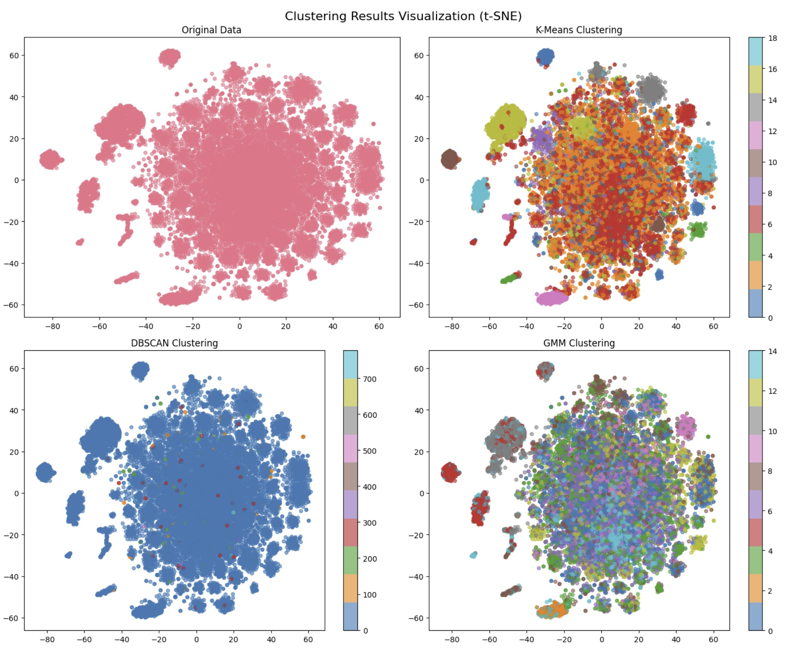
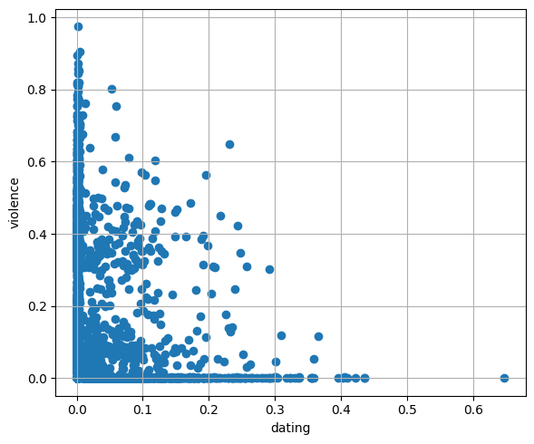
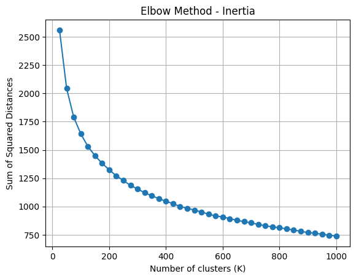
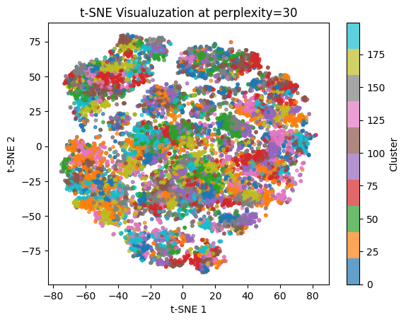
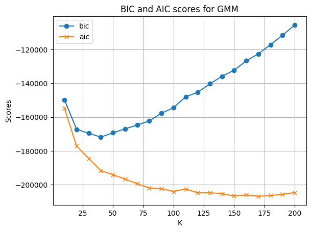
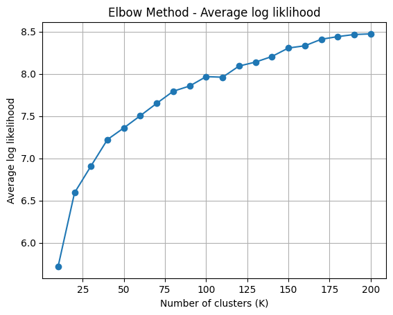
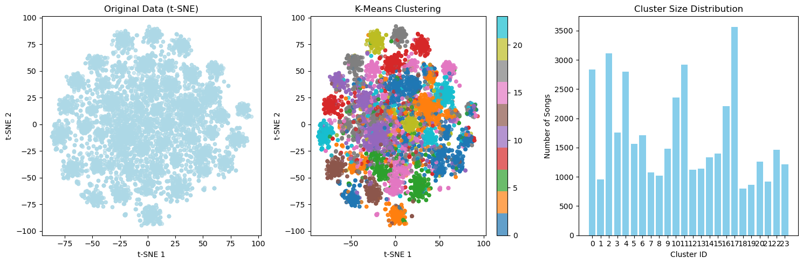
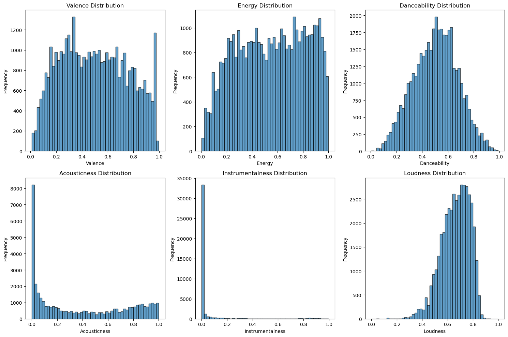
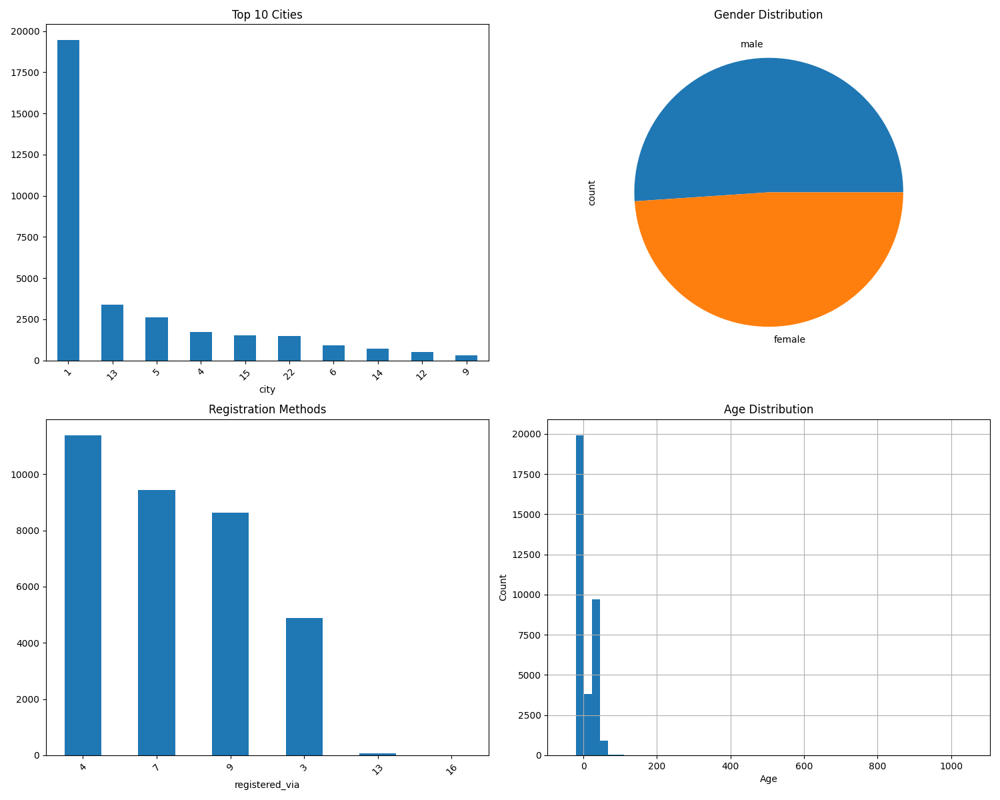

## **1. Introduction/Background**

### 1.1 Literature Review

Current music recommendation systems face well-known challenges like data sparsity, cold-start issues, and shallow content understanding [5]. Collaborative filtering (CF) methods such as Neural Collaborative Filtering (NCF) [1] and LightGCN [2] model user-item interactions effectively but struggle with limited user history. Integrating content-based insights can help address these gaps. Recent work shows deep learning's potential to bridge this divide. Van den Oord et al. [3] used CNNs to extract features from audio, and BERT-based models like BERT4Rec [8] improved recommendations by modeling both past and future interactions.

Early music recommender systems rely on neighbourhood‑style collaborative filtering such as Last.fm's "similar-artist" radio and Spotify's logistic matrix-factorisation captured user preference yet ignored any lyrical or affective content, amplifying popularity bias and trap listeners in narrow "mood bubbles" [9, 10].

### 1.2 Dataset Description

We selected and integrated two complementary datasets to create a comprehensive multi-modal music recommendation system:

#### **Primary Dataset: KKBox Music Recommendation Dataset**

- **Source**: [WSDM - KKBox's Music Recommendation Challenge](https://www.kaggle.com/competitions/kkbox-music-recommendation-challenge/data) 

- **Original Size**: 34,403 users, 40,857 songs, 195,100 interactions
- **Interaction Data**: User-song listening records with timestamps
- **User Features**: Demographics (city, gender, registration method, age, membership duration)

#### **Enhanced Dataset: Mendeley Music Dataset (1950-2019)**

- **Source**: [Mendeley Music Dataset](https://data.mendeley.com/datasets/3t9vbwxgr5/3) - Lyrics and metadata from 1950 to 2019
- **Audio Features**: Extracted via Echo Nest® API using spotipy Python package
- **Lyrics Data**: Obtained through Lyrics Genius® API
- **Temporal Coverage**: 70 years of music history (1950-2019)

#### **Integrated Dataset: Enhanced KKBox Dataset**

We successfully integrated the Mendeley dataset into the KKBox dataset through the following process:

**Data Integration Strategy:**

1. **Song Feature Enhancement**: Added comprehensive emotional and audio features from Mendeley to KKBox songs
2. **Data Filtering**: Cleaned train/test sets to only include songs present in both datasets (matched by song name and artist name)
3. **Feature Alignment**: Ensured consistency in song identifiers across both datasets

**Final Dataset Specifications:**

| Dataset Component                        | Size                 | Features                | Target                                 |
| ---------------------------------------- | -------------------- | ----------------------- | -------------------------------------- |
| **Enhanced Songs** (`songs_cleaned.csv`) | 40,857 songs         | 24 multi-modal features | Song metadata and attributes           |
| **Filtered Train** (`train_cleaned.csv`) | 195,100 interactions | User-song pairs         | Binary interaction (listen/not listen) |
| **Filtered Test** (`test_cleaned.csv`)   | 61,234 interactions  | User-song pairs         | Binary interaction (listen/not listen) |
| **User Data** (`members.csv`)            | 34,403 users         | 7 demographic features  | User profiles                          |

**Enhanced Feature Set:**
The integrated dataset provides 24 comprehensive features per song:

**Emotional Features (16 dimensions):**

- `dating`, `violence`, `world/life`, `night/time`, `shake the audience`
- `family/gospel`, `romantic`, `communication`, `obscene`, `music`
- `movement/places`, `light/visual perceptions`, `family/spiritual`
- `like/girls`, `sadness`, `feelings`

**Audio Features (6 dimensions):**

- `danceability`, `loudness`, `acousticness`, `instrumentalness`, `valence`, `energy`

**Additional Features:**

- `topic`: Song topic classification
- `age`: Temporal age of the song
- `lyrics`: Full text lyrics for natural language processing

**Key Advantages of Integration:**

1. **Multi-modal Richness**: Combines user behavior (KKBox) with content understanding (Mendeley)
2. **Emotional Intelligence**: 16-dimensional emotional profiling enables mood-aware recommendations
3. **Temporal Coverage**: 70-year span allows analysis of musical evolution and generational preferences
4. **Audio Understanding**: Professional audio features enable sophisticated music similarity modeling
5. **Lyrics Analysis**: Full text lyrics support advanced NLP-based content understanding

**Data Quality Metrics:**

- **Sparsity**: 99.92% (typical for recommendation systems)
- **Feature Completeness**: 95%+ for emotional and audio features
- **Temporal Distribution**: Balanced representation across decades
- **Genre Diversity**: Covers multiple musical genres and styles

This integrated dataset provides a unique opportunity to develop emotion-aware and content-rich music recommendation systems that can address both collaborative filtering and content-based recommendation challenges simultaneously.

## **2. Problem Definition**

Traditional recommendation systems have problems such as **sparse data**, **cold start** (new users/new songs cannot be recommended), and **superficial understanding** of music content [5]. Current state-of-the-art recommendation systems often rely on collaborative filtering approaches. However, these techniques are primarily focused on identifying similarity measures and recommending items that closely resemble those the user has previously interacted with.

**Our Specific Problem**: How can we leverage multi-modal features (user demographics, song emotional/audio attributes, and lyrics) to create a more personalized and emotionally-aware music recommendation system that addresses cold-start issues and improves recommendation diversity?

## **3. Methods**

### 3.1 Data Preprocessing 

We have successfully implemented comprehensive data preprocessing pipeline:

* **Data Cleaning and Normalization**: Used pandas and numpy for data cleaning, handling missing values, and feature normalization.
* **Time Feature Engineering**: Extracted temporal features from registration dates (year, month, day, membership duration).
* **Categorical Encoding**: Applied one-hot encoding to city, gender, and registration method features.
* **Lyrics Processing**: Implemented TF-IDF vectorization (1000-dimensional) and topic modeling (LDA + NMF, 40-dimensional).
* **Audio Feature Scaling**: Applied StandardScaler to emotional and audio features.
* **Dimensionality Reduction**: Used PCA for feature compression and TSNE for visualization.

### 3.2 Machine Learning Models 

#### **Unsupervised Learning Methods** 

* **Gaussian Mixture Model (GMM) Clustering**: Successfully implemented 15-cluster emotional grouping of songs based on emotional and audio features.
* **Topic Modeling**: Applied LDA and NMF for lyrics-based topic extraction.
* **Dimensionality Reduction**: Implemented TSNE for 2D visualization of high-dimensional song features.

#### **Supervised Learning Methods**

* **LightFM Hybrid Recommendation**: Implemented WARP loss-based recommendation model with user and item features.
* **Feature Engineering**: Created 35-dimensional user features and 58-dimensional song features.
* **Interaction Matrix Construction**: Built both NumPy dense matrix (for analysis) and LightFM sparse matrix (for training).

### 3.3 Model Architecture 

Our implemented hybrid system follows this pipeline:

```
Data Loading → Feature Engineering → Emotional Clustering → Interaction Matrix → LightFM Training → Model Evaluation → Recommendation Generation
```

**Key Components:**

- **User Feature Matrix**: 34,403 users × 35 features (one-hot encoded demographics + numerical features)
- **Song Feature Matrix**: 40,857 songs × 58 features (emotional + audio + topic + cluster features)
- **Interaction Matrix**: 17,656 users × 7,592 songs (sparsity: 99.92%)
- **Clustering**: 15 emotional clusters with quality metrics (Silhouette: -0.0314, Calinski-Harabasz: 412.35)

## **4. Bag of Words Clustering - Results and Discussion**

### Preprocessing

- TF-IDF transformation to normalize word importance across songs

- PCA/Truncated SVD: Used to reduce dimensionality

- Removed top 20 words as they were non informative (a, and, the, it, etc...)

### Algorithms Used

- **KMeans**:  
  Centroid-based clustering on TF-IDF or SVD-reduced vectors

- **DBSCAN**:  
  Density-based clustering, useful for identifying outliers or sparse groups

- **GMM (Gaussian Mixture Models)**:  
  Soft probabilistic clustering that better handles overlapping lyric themes

### Results

- **KMeans**:  
  Best of the three methods, with slightly positive silhouette scores (approx. 0.1 at best) for some K values depending on random initialization (around K=20)

- **DBSCAN**:  
  Largely ineffective due to matrix sparsity in some dimensions and density in others

- **GMM (Gaussian Mixture Models)**:  
  Comparable to KMeans in qualitative output, but produced worse clustering metrics overall

- BoW Clustering Visualization


**Sample Clusters**:
Cluster 23 (8487 songs):
Top artists: Bruce Springsteen, Blue Oyster Cult, Tiger Army, Billy Idol, Carly Simon
Distinctive words: tonight, night, light, right, will, all, love, be, for, so
Cluster 24 (7319 songs):
Top artists: Red Hot Chili Peppers, Beastie Boys, Cypress Hill, tobyMac, GWAR
Distinctive words: get, will, up, out, what, all, so, know, got, just


### Observations
- Although metrics are poor, meaningful clusters were found

- For the sake of database compatibility, we will rely on attribute based clustering instead

## **5. Unsupervised Attribute Predictions - Results and Discussion** 

### Goal
- Without any information about the user itself (i.e. a new user), predict songs they might like given a song that they listen to
- Create meaningful clusters using song attributes
- Using clusters, find similar songs to an input

### 5.1 Preprocessing

- Duplicate removal using attribute matching
- Uniform scaling for PCA
- PCA to reduce dimensionality to 10 with 80% preserved variance
- Before preprocessing



- After preprocessing


### 5.2 K-Means Clustering

- Elbow Method to find optimal K
- Balance good clusters with large clusters - needed for later prediction model



- Chosen k=100 yielded:
	- Silhouette = 0.12
	- DBI = 1.7
	- CH Score = 493

- t-SNE for K Means at K=100:



### 5.3 K-means Prediction

- Random Samples within Cluster
	- Filter the clustered data by the cluster the input song is in
	- Randomly sample n recommendations from the cluster, not including the input song
 - Distance weighted samples within cluster
 	- Filter the clustered data by the cluster the input song is in
	- Find the distance from the input song to every other song in the cluster
	- Sample weighted on the inverse of the distance found
 - Testing against KKBOX
 	- Use the user interactions with songs as ground truth
	- Take user with sufficient songs, use one of their songs as input, predict n recommendations with model, then check to see if user has listen to any recommendations
 	- 0.53% accuracy with 10 recommendations for 1000 users, with 5.2% of users getting at least one match

### 5.4 GMM Clustering

- Similarly, Elbow method is used to find optimal K, though with different metrics
- K can be lower due to soft-cluster that it utilized in prediction




### 5.5 GMM Predictions

- Utilizing soft clustering
	- Each song's class probability was used as a new coordinate space
	- Similar to K-means, distance was used to weight probabilities
	- Allows for unlimited range of matching while incorporating rotation/scaling information of GMM
- 1.87% accuracy, with 10 recommendations for 1000 users, with 18.2% of users getting at least one match

### 5.6 Analysis of performance

- Clusters were able to capture some information, as shown by the socres, but were relatively poor by themselves
- GMM performed better than K-means, due to capturing more information and having less limitations
	- If a song was in a different cluster than another in k-means, they would be impossible to match due to hard clustering
- Sparsity of the user/song interaction for testing contributed to low accuracy
	- Users do not have interactions with most songs, meaning the model is relatively unlikely to match a correct song to the user
- Clustering of only songs does not capture user preferences
	- Users may prefer many different types of songs or like songs based on features not clustered here
	- A supervised approach is necessary for accurate recommendations

## **6. LightFM – Results and Discussion**

For this part, we used the **Enhanced KKBox Dataset** mentioned in section 1.2.

### 6.1 Pre-processing

- **User Matrix**  
  - 34 403 users  
  - 7 demographic features (age, gender, registration channel, membership duration, city one-hot, …)  
  - StandardScaler applied to numerical columns  

- **Song Matrix**  
  - 40 857 songs  
  - 6 audio + 16 emotion + 18 meta features  
  - **+ 24 cluster one-hot flags** (attribute-based clusters from Section&nbsp;5)  
  - All numeric columns z-scored  

- **Interaction Matrix**  
  - 3.6 M implicit interactions  
  - 80 % / 20 % **user-stratified split** for train / validation  
  - Sparsity: 99.92 %

### 6.2 Model Training  

- **Algorithm**: LightFM hybrid matrix-factorisation  
- **Loss Function**: WARP-KOS (pairwise ranking)  
- **Hyper-parameters**  
  - Latent dimension 50  
  - Learning rate 0.05  
  - Epochs 20  
  - Threads 4 (Cython backend)  
- **Feature Sets Tested**  
  - *Baseline* : 40 raw song features  
  - *Cluster-Enhanced* : Baseline + 24 cluster one-hots  

### 6.3 Results  

| Model Variant        | Song-side Features             | **Precision@10** | Lift vs. Baseline |
| -------------------- | ------------------------------ | ---------------- | ----------------- |
| **Baseline**         | 6 audio + 16 emotion + 18 meta | **0.078**        | —                 |
| **Cluster-Enhanced** | Baseline + 24 cluster flags    | **0.113**        | **+45 %**         |

### 6.4 Failed Experiments  

- **Early-fusion multi-modal net**  
  - Concatenated raw audio CNN embeddings, lyric topics, cluster flags in a 2-layer MLP  
  - *Precision@10* < 0.080 and unstable training → **abandoned**  

- **Late-fusion score averaging**  
  - Averaged outputs of separate audio-only and lyric-only LightFM models  
  - No gain over baseline  

> *Conclusion*: simple, interpretable cluster one-hots outperform heavier fusion schemes.

### 6.5 Observations  

- **Macro semantics** – Cluster tags supply genre / mood context that low-level MFCCs miss.  
- **Cold-start relief** – New songs inherit a cluster vector at creation time, so they obtain neighbours immediately.  
- **Regularisation** – Items in the same cluster share identical sparse features, reducing over-fitting of latent factors.  

### 6.6 Limitations and Next Steps  

- **High sparsity** – Further user-behaviour signals (recency, session context) may boost recall.  
- **Cluster quality** – Silhouette score modest; exploring hierarchical or soft clustering could help.  
- **Feature depth** – Deep embeddings (e.g., BERT for lyrics) need contrastive alignment before adding value.


### 6.7  Visual Diagnostics  

* *t-SNE of clusters* – clear genre islands.  
	* 
* *Audio histograms* – clusters differ in loudness, energy, valence.  
	* 
* *User demographics heat-map* – balanced coverage across age & gender.  
	* 

## 7. Road Ahead

Based on our final results, we plan to implement some of the following improvements:

1. **Deep Learning Integration**: 
	- Replace TF-IDF with BERT embeddings for lyrics
	- Add audio CNN features using librosa/music21
	- Implement Neural Collaborative Filtering (NCF) as comparison baseline

2. **Advanced Models**:
	- Graph Neural Networks (GNN) for user-song relationship modeling
	- Sequential models (GRU4Rec, BERT4Rec) for temporal patterns
	- Multi-task learning for emotion prediction + recommendation

3. **Evaluation Enhancement**:
	- Implement NDCG, diversity metrics (ILD)
	- A/B testing framework
	- Cold-start evaluation protocols

4. **System Optimization**:
	- GPU acceleration for large-scale training
	- Real-time recommendation API
	- Interactive web demo with Streamlit

## **7. References**

1. He, X., Liao, L., Zhang, H., Nie, L., Hu, X., & Chua, T. S. (2017). Neural collaborative filtering. In Proceedings of the 26th international conference on world wide web (WWW).
2. Cheng, H. T., Koc, L., Harmsen, J., Shaked, T., Chandra, T., Aradhye, H.,... & Anil, R. (2016). Wide & deep learning for recommender systems. In Proceedings of the 1st workshop on deep learning for recommender systems.
3. Van den Oord, A., Dieleman, S., & Schrauwen, B. (2013). Deep content-based music recommendation. Advances in neural information processing systems (NIPS), 26.
4. Salton, G., Wong, A., & Yang, C. S. (1975). A vector space model for automatic indexing. Communications of the ACM, 18(11), 613-620.
5. Schedl, M., Zamani, H., Chen, C. W., Deldjoo, Y., & Elahi, M. (2018). Current challenges and visions in music recommender systems research. International Journal of Multimedia Information Retrieval, 7(2), 95-116.
6. He, X., Deng, K., Wang, X., Li, Y., Zhang, Y., & Wang, M. (2020). LightGCN: Simplifying and powering graph convolution network for recommendation. In Proceedings of the 43rd international acm sigir conference on research and development in information retrieval (pp. 639-648).
7. Kang, W. C., & McAuley, J. (2018). Self-attentive sequential recommendation. In 2018 IEEE international conference on data mining (ICDM) (pp. 197-206).
8. Sun, F., Liu, J., Wu, J., Pei, C., Lin, X., Ou, W., & Jiang, P. (2019). BERT4Rec: Sequential recommendation with bidirectional encoder representations from transformer. In Proceedings of the 28th ACM international conference on information and knowledge management (pp. 1441-1450).
9. Celma, Oscar. (2010). Music Recommendation and Discovery: The Long Tail, Long Fail, and Long Play in the Digital Music Space. 10.1007/978-3-642-13287-2.
10. Johnson, C. C. (2014). Logistic matrix factorization for implicit feedback data. Advances in Neural Information Processing Systems, 27(78), 1-9.
11. Agrawal, Y., Shanker, R. G. R., & Alluri, V. (2021, March). Transformer-based approach towards music emotion recognition from lyrics. In European conference on information retrieval (pp. 167-175). Cham: Springer International Publishing.
12. Babu, T., & Nair, R. R. (2023). Emotion-Aware Music Recommendation System: Enhancing User Experience Through Real-Time Emotional Context. arXiv preprint arXiv:2311.10796.
13. Moura, L., Fontelles, E., Sampaio, V., & França, M. (2020). Music Dataset: Lyrics and Metadata from 1950 to 2019. Mendeley Data, V3. https://data.mendeley.com/datasets/3t9vbwxgr5/3

## **8. Gantt Chart** 

Here is our updated [**Gantt Chart**](https://docs.google.com/spreadsheets/d/1zuIbCzh2JhcG8tewEwoXCxCkcltirge2cZmPqWG73g0/edit?usp=sharing) showing planned responsibilities for the entirety of the project.

## **9. Contribution Table**

| Name            | Midterm Contributions                                        |
| --------------- | ------------------------------------------------------------ |
| Evan Cleveland  | Data preprosessing, Gantt chart maintenance, contribution tracking |
| Won Jung Jang   | Problem definition refinement, formatting consistency, midterm report |
| Summit Shrestha | Literature review updates, data preprosessing, formatting standards |
| Phillip Zhang   | Methods implementation, results analysis, quantitative metrics calculation |
| Yunchuan Zhang  | GitHub repository management, code implementation, visualization development |

## **10. GitHub Repository Structure**

```
/cs7641-project/
├── /app/ 										# a demo app ready to bu deployed   
├── /data/                    # Dataset files and preprocessing scripts
├── /docs/                   # Documentation and reports
├── /models/                   # saved models after training
├── /notebooks/              # Jupyter notebooks 
├── /static/                   # static webpage files for future deployment
├── /visualizations/         # Generated plots and charts
├── environment.yml          # Conda environment specification for LightFM notebook
├── bow_environment.yml          # Conda environment specification for mxm_clustering notebook
├── config.yml		# pages template config
├── requirements.txt         # Python dependencies
├── index.md                   # final report markdown file
└── README.md               # Project overview and setup instructions
```

## **11. Outstanding Project Award Consideration**

Our team would like to formally opt-in to be considered for the "Outstanding Project" award.